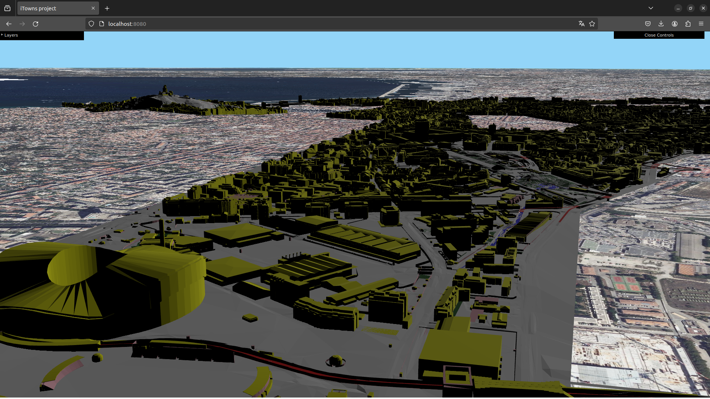
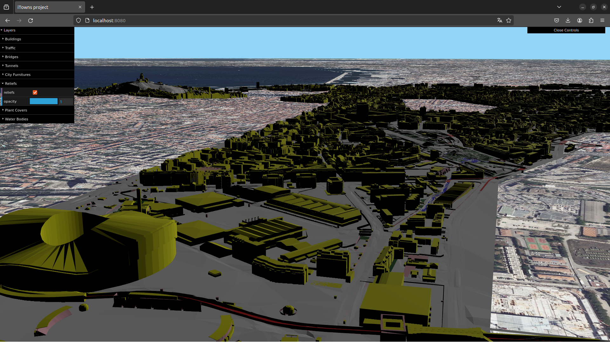
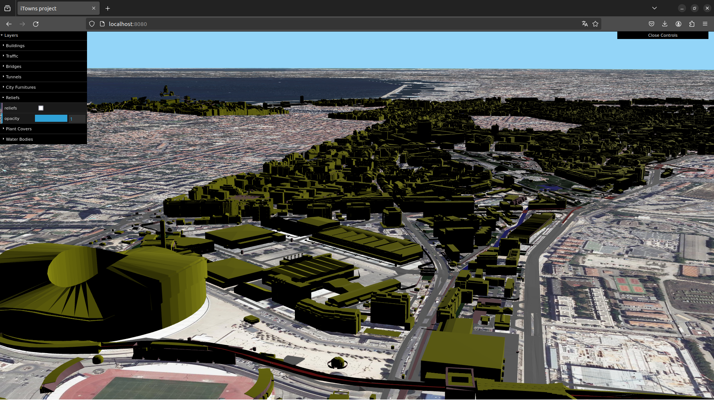

# Itowns - CityGML to 3DTiles pipeline

## Initialize repository

```bash
git clone https://github.com/AxelDmt/itowns_project.git
cd itowns_project
./init-rep.sh
```

## Initialize 3DCityDB on PostgreSQL

Go to ../3dcitydb-4.4.0/postgresql/ShellScripts/Unix/CONNECTION_DETAILS.sh and **change the content** of the file to this : 

```bash
#!/bin/bash
# Provide your database details here ------------------------------------------
export PGBIN=/etc/postgresql/14/main
export PGHOST=localhost
export PGPORT=5432
export CITYDB=my3dcitydb
export PGUSER=postgres
#------------------------------------------------------------------------------
```

When this is done, **execute [init-3dcitydb.sh]([init-3dcitydb.sh](https://github.com/AxelDmt/itowns_project/blob/master/bash-scripts/init-3dcitydb.sh))** :

```bash
./init-3dcitydb.sh
```

If everythings runs the right way you should see this :

```bash
######################################################################################

 _______   ___ _ _        ___  ___ 
|__ /   \ / __(_) |_ _  _|   \| _ )
 |_ \ |) | (__| |  _| || | |) | _ \
|___/___/ \___|_|\__|\_, |___/|___/
                     |__/          

3D City Database - The Open Source CityGML Database

######################################################################################

Welcome to the 3DCityDB Setup Script. This script will guide you through the process
of setting up a 3DCityDB instance. Please follow the instructions of the script.
Enter the required parameters when prompted and press ENTER to confirm.
Just press ENTER to use the default values.

Documentation and help:
   3DCityDB website:    https://www.3dcitydb.org
   3DCityDB on GitHub:  https://github.com/3dcitydb

Having problems or need support?
   Please file an issue here:
   https://github.com/3dcitydb/3dcitydb/issues

######################################################################################

Please enter a valid SRID (e.g., EPSG code of the CRS to be used).
(SRID must be an integer greater than zero): 2154

Please enter the EPSG code of the height system (use 0 if unknown or '2154' is already 3D).
(default HEIGHT_EPSG=0): 

Please enter the corresponding gml:srsName to be used in GML exports.
(default GMLSRSNAME=urn:ogc:def:crs:EPSG::2154): 

Connecting to "postgres@localhost:5432/my3dcitydb" ...
Password for user postgres: 
```

## Start local servers

### Starting itowns :

```bash
cd itowns-starter-webpack
npm install
npm start --cors
```

### Starting data server for itowns :

```bash
npm install -g http-server
http-server --cors -p 8000
```

## Importing CityGML data in your 3DCityDB

```bash
./import.sh
```

If everythings runs the right way (and enter ‘2’) you should see this :

```bash
######################################################################################
 ________  _________ ___________ _____ 
|_   _|  \/  || ___ \  _  | ___ \_   _|
  | | | .  . || |_/ / | | | |_/ / | |  
  | | | |\/| ||  __/| | | |    /  | |  
 _| |_| |  | || |   \ \_/ / |\ \  | |  
 \___/\_|  |_/\_|    \___/\_| \_| \_/  

3D City Database - Import CityGML data

######################################################################################

Welcome to this script which allows you to import CityGML data to a postgreSQL 3DCityDB.
This script will guide you through the process of setting up the import.
Please follow the instructions of the script.
Enter the required parameters when prompted and press ENTER to confirm.

######################################################################################

Select import mode:
1. Import a single CityGML file
2. Import all CityGML files in a directory
Enter your choice (1 or 2): 2
Username: 
Password: 
Host: host
Database name: 
Import Mode (import_all/skip/delete/terminate): 
Path to directory containing CityGML files (path/to/directory):
```

## Converting CityGML data into 3DTiles

```bash
./citygml-to-3dtiles.sh
```

If everything runs the right way (and enter ‘21’ or ‘12’) you should see this :

```bash
######################################################################################
 _____ _   _ _____ _____ _____ _____   ___________ _____ _____ _____ _   _ 
/  __ \ | | |  _  |  _  /  ___|  ___| |  _  | ___ \_   _|_   _|  _  | \ | |
| /  \/ |_| | | | | | | \ `--.| |__   | | | | |_/ / | |   | | | | | |  \| |
| |   |  _  | | | | | | |`--. \  __|  | | | |  __/  | |   | | | | | | . ` |
| \__/\ | | \ \_/ | \_/ /\__/ / |___  \ \_/ / |     | |  _| |_\ \_/ / |\  |
 \____|_| |_/\___/ \___/\____/\____/   \___/\_|     \_/  \___/ \___/\_| \_/

Choose converting options from CityGML (.gml) to 3DTiles (.b3dm)

######################################################################################

Welcome to this script which allows you to choose options to convert CityGML data into 3DTiles.
This script will guide you through the process of setting up the convertion.
Please follow the instructions of the script.
Enter the required parameters when prompted and press ENTER to confirm.

######################################################################################

Options available:

1. Object Type
2. Reprojection

Press ENTER without writing anything if you chose none of the options available

Enter your choice(s) (e.g., 1 for Object Type, 2 for Reprojection, 12 or 21 for both): 21

Object Types available: building, relief, water, bridge, traffic, tunnel, plant, furniture, all
Enter multiple types separated by spaces (e.g., 'building water traffic'):
relief

Enter Input CRS: 2154

Enter Output CRS: 4978
```

## Use iTowns

To use iTowns and visualize your converted data, go to : **[http://localhost:8080/](http://localhost:8080/)** 

### Explore your 3D dataset with iTowns

**Controls :**

→ Left click : translate on X Y Axis

→ Right click : translate on Z Axis

→ Left shif + left click : rotate on X Y Z Axis



### Choose which layer you want to see with control menu





### Tips

You can **change the color** of each layer by modifying the index.js code in itowns-starter-webpack/src directory like showed in the example bellow : 

```python
///////////////////////////// Relief /////////////////////////////////////////////////////////

const reliefsSource = new itowns.C3DTilesSource({
    url: 'http://localhost:8000/py3dtilers/junk_reliefs/tileset.json',
});

const reliefsLayer = new itowns.C3DTilesLayer('reliefs', {
    source: reliefsSource,
    style: { fill: { color: 'yellowgreen'}}, //<- CHANGE THE COLOR HERE
}, view);
itowns.View.prototype.addLayer.call(view, reliefsLayer);
```

## How to deals with implicit geometries ?

### Collect informations

**Run** the [bdexporter.py](bdexporter.py) python script. This code will create a dictionnary which regroup useful informations about implicit geometries.

### Georeferenced 3D objects

For this step we first need to **have .obj files**, if not and your files are .3ds execute : 

```bash
./3ds_to_obj.sh
```

Before the next execute lines you need to **personalize [objTransformer.py](objtransformer.py/)** in /python-scripts/implicit-geom/ directory :

```python
# Example usage:
matrix = [                  
    1.0, 0.0, 0.0, 0.0,
    0.0, 1.0, 0.0, 0.0,        #Write your matrix as a simple List
    0.0, 0.0, 1.0, 1.0,
    0.0, 0.0, 0.0, 1.0
]
input_file = 'path/to/file.obj'  # Path to your .obj file
point_reel = "your wkb coordinate in hexadecimal"
output_file = 'output/output.obj'
```

Afterwards **execute** those lines : 

```bash
python3 [objTransformer.py](http://objtransformer.py/)
obj-tiler -i path/to/file.obj -o junk_implicitgeom --crs_in "crs of your transformed .obj file" --crs_out 4978
```
